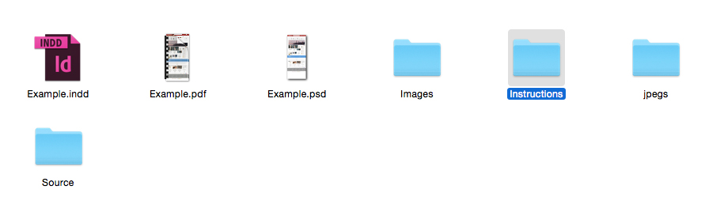
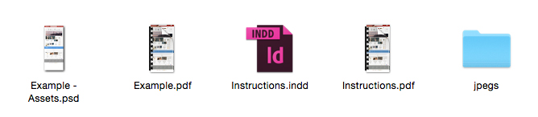

.. title:: Assets & Instructions

Assets & Instructions
=====================

Once the designs are approved the PSD needs to be formatted for a developer and we need to create a PDF for the developer with Instructions. These are annotated screens of the web page put together in an indesign file

Assets
------------

1. The PSD needs to be tidied up so that there no extra layers and the buttons (Up / Over) states are clear.

2. All images should be rasterized and there should be no shape files.

3. All large header graphics and block graphics should be flattened and made up of one layer.

4. The PSD is then titled “Client Name - Assets”

.. note::
	
    Please reference the Example PSD when making an Assets PSD to see how functionality and layers are formated in an assets PSD.
   

Instructions
------------

1. Instructions are to show the developer the functionality and front end effects that will be used across the website. The instructions are more in depth for bespoke websites.

2. One page should showcase the change between a button or link when it’s hovered over for all the links across the site. (Usually showcasing these states for the just homepage will then extend to the rest of the site).

3. Point out what fonts have been used throughout the site. (Usually identifying these on the homepage will extend throughout the site unless a font has been used one off on another page.)

4. Point out any unique functionality or animation which will be used on the site.

5. Point out where plugins or extensions have been used and if there’s any unique styling to be incorporated.

6. Send a link to any google fonts

7. This is then saved out as a PDF titled ‘Instructions’

.. note::
	
    Please reference the Example PDF when making an instructions PDF to see what should be annotated and what kind of functionality should be explained. 
   

Fonts
------------

1. Include any fonts in the package of files which are not available to download but will need to be embedded in the site.

Unannotated
------------

1. A full PDF of the website for the developer to use as a reference.

Supply
------------

All of the above should be put together in a ZIP file and then added to the Dropbox Folder ‘Check Before Send to Program’

Make a note of where the assets and instructions have been added to and then add this to the task. Then assign the task back to the account handler.

Folder Formatting at this Stage
------------

We use a specific file structure to remove confusion if someone else has to pick up
where you left off on your work. At this stage the folder should be organised as the
following:

• PSD with Client / Site name as the title.
• Images Folder – This is imagery that the client has supplied for the brief.
• Source Folder– This is inspiration and graphics that you’ve found online that were used in reference when designing the site.
• Jpegs Folder– Where the saved out images of the full site go.
• InDesign Document – Used to create the PDF of the site.
• Visual PDF of site – With the Client’s site name as the title.
• Instructions Folder

The Instructions Folder Should Contain the following:
• Assets PSD
• Instructions PDF
• Instructions Indesign file.
• Un-annotated pdf
• Jpegs to create the above.

This will all go in to a folder with with the Site / clients name as the title which is then
put on to the server.

    How your client Folder should be structured at this stage
    

    How the Instructions folder should be structured