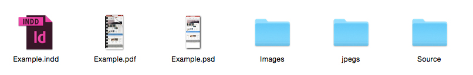

.. title:: First Visuals

First Visuals
=====================

Brief
------------

A brief will be provided containing some combination of the following:

• A company name and description.
• A brief description of what the site is about, who it’s for and what they want to achieve by getting a new site.
• A selection of websites the client likes – both in their field and for visual reference.
• A mention of whether it’s a ‘Package’ Site or if it’s Bespoke (a wireframe will be provided)
• A breakdown of special features / plugins that the site may have.
• Possible: A logo or previous logo. A new logo may need to be designed for the site.
• Possible: The company’s business plan / strategy.

Design - Part 1
------------

Starting Point:

There’s 2 options here.

1. A site may be a ‘Package Site’ or ‘Starter Theme’ site (they go by different names).
All this means though is that the design’s point of development will be the basic
Magento Starter theme. Often these sites follow a certain layout with only a few
key changes which are often specific to each brief. For instance, the website www.
Shayandblue.com is a good example of a theme with very little changes made to it.
The site www.auxprive.co.uk is another example of a ‘package’ site however it had
many more custom elements added to it.

2. A site may be designed over a pre built wireframe. This will have been developed
between the account handler and the client. A bespoke wireframe will often look to
fulfill many needs the client has and if usually used on sites which have bought a
more expensive package with us.

Design - Part 2
------------

Design the Site to the specification of the brief using the appropriate starting point.

1. If they have no or an outdated logo then one will need to be designed.
2. Design the entire homepage of the website.
3. Include any special features or plugin’s that the brief requires.

Once the homepage is designed some functionality of the site on the homepage needs
to be shown. So design:

• The over states of the buttons on the website.
• The over state and dropdown of the navigation.
• The dropdown of the Basket on click or hover.
• A favourites icon active (if applicable)
• If the site has a pop up on the homepage then this should be shown.

.. note::
	
    Get feedback on the design from account handlers and other designers. (Often done 
    informally throughout the process – sometimes feedback is given after the next step).
   

Supply
------------

To supply the first visual: Assemble a PDF which contains views of the Homepage in all states from step 2.

The PDF should contain a visual per page of:

• The Homepage
• The Over states
• The dropdown states
• The basket dropdowns
• The favourites pop out active – if there is one
• Pop Ups for the site if they are any.

Add this PDF to the Asana task and send back to the account handler.

Feedback from Client & Account Handler
------------

Visual amends from the account handler usually come first. If there are amends then these will done on the PSD and then re-supplied as the PDF as before.

The PDF is then sent to the client for approval and/ or amends.

If the client has any amends then the same process will be followed with the visual being updated with the client’s amends and then re-supplying the PDF.

Once approved we proceed to the next step....

Folder Formatting at this Stage
------------

We use a specific file structure to remove confusion if someone else has to pick up
where you left off on your work. At this stage the folder should be organised as the
following:

• PSD File - with Client / Site name as the title.
• Images Folder – This is imagery that the client has supplied for the brief.
• Source Folder – This is inspiration and graphics that you’ve found online that were used in reference when designing the site.
• Jpegs Folder – Where the saved out images of the full site go before being exported.
• InDesign Document – Used to create the PDF of the site.
• First Visual PDF of site – With the Client’s site name as the title.

This will all go in to a folder with with the Site / clients name as the title which is then
put on to the server.

    How your client Folder should be structured at this stage